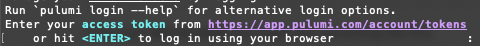
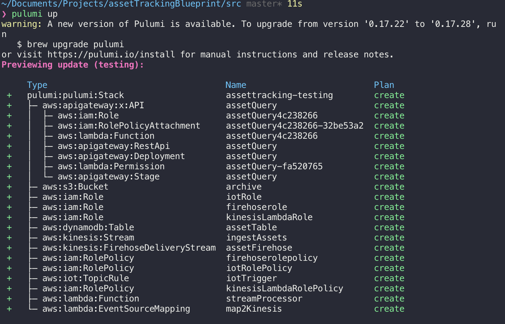
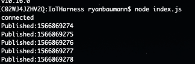
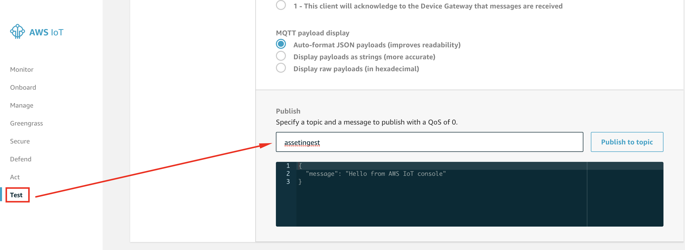
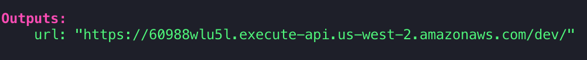

# Asset Tracking Solution

This project will deploy a serverless [Asset Tracking](https://www.mapbox.com/solutions/asset-tracking) infrastructure using Mapbox, AWS, and Pulumi.

This repository contains the following:

- Deployment code using [Pulumi](https://www.pulumi.com/docs/index.html)
- Node scripts to send sample events to the pipeline
- A sample web map to visualize the live location and status of events sent to the pipeline.

After deploying this solution, you will have see a sample live asset dashboard .


- [Asset Tracking Solution](#asset-tracking-solution)
  - [Getting started](#getting-started)
    - [AWS Account](#aws-account)
      - [AWS IAM](#aws-iam)
    - [Pulumi CLI](#pulumi-cli)
      - [Mac](#mac)
      - [Windows](#windows)
    - [Node.js](#nodejs)
    - [Mapbox Account](#mapbox-account)
  - [Installation](#installation)
    - [Organization](#organization)
  - [Deployment](#deployment)
  - [Interacting with the pipeline](#interacting-with-the-pipeline)
    - [Sending Data](#sending-data)
    - [Visualizing Data](#visualizing-data)
    - [Querying Data](#querying-data)
    - [Geofencing](#geofencing)
  - [Next Steps](#next-steps)
  - [Built With](#built-with)
  - [Authors](#authors)
  - [License](#license)
  - [Acknowledgments](#acknowledgments)

## Getting started

Before you begin, make sure you have the following tools configured:

### AWS Account

You will need an AWS account in order to deploy the infrastructure via Pulumi. If you do not have one, please read the [Getting Started with AWS](https://aws.amazon.com/getting-started/).

Once you have an account, you can get more details on how to get your AWS credentials and set them for use with Pulumi by [reading their setup instructions](https://www.pulumi.com/docs/reference/clouds/aws/setup/).

You do not need to have `aws-cli` installed, but it can help with [setting up your AWS profile](https://docs.aws.amazon.com/cli/latest/userguide/cli-chap-configure.html). Installation instructions for `aws-cli` can be found in [its AWS documentation](https://docs.aws.amazon.com/cli/index.html).

If you do not want to set up a terminal profile, or if you wish to set your credentials manually you can do so via your terminal.

```bash
export AWS_ACCESS_KEY_ID={my-aws-access-key}
export AWS_SECRET_ACCESS_KEY={my-aws-secret-key}
```

If you already have your AWS profile configured in your terminal of choice, Pulumi will read those by default. The only warning is that your user (if using IAM) must have sufficient credentials to deploy the chosen infrastructure (listed below).

#### AWS IAM

If you are using an IAM user for AWS credentials, your user must have permissions to the following services

- IoT
- Kinesis Data Streams
- Kinesis Firehose
- Lambda
- API Gateway
- DynamoDB
- S3

### Pulumi CLI

Pulumi is used to deploy the solution AWS infastructure. Follow the instructions below to install the Pulumi CLI, or [consult the documentation](https://www.pulumi.com/docs/reference/install/) for more details.

You will also need to sign up for a free account with Pulumi. Without one you will likely be prompted to create one when you run your first CLI command.



#### Mac

Requires [homebrew](https://brew.sh) to install.

```bash
brew install pulumi
```

You should also make sure you are on the latest version of Pulumi (>=3.5.1)

```bash
brew upgrade pulumi
```

#### Windows

Run the following from `cmd.exe`

```bash
@"%SystemRoot%\System32\WindowsPowerShell\v1.0\powershell.exe" -NoProfile -InputFormat None -ExecutionPolicy Bypass -Command "[Net.ServicePointManager]::SecurityProtocol = [Net.SecurityProtocolType]::Tls12; iex ((New-Object System.Net.WebClient).DownloadString('https://get.pulumi.com/install.ps1'))" && SET "PATH=%PATH%;%USERPROFILE%\.pulumi\bin"
```

If the above command fails, follow the manual install instructions from [Pulumi's website docs](https://www.pulumi.com/docs/reference/install/#manual-installation).

### Node.js

Pulumi requires [Node.js v12+](https://nodejs.org/en/download/).  Check that your installed node version is >= v12 with `node -v`.

### Mapbox Account

You need a valid Mapbox token to make requests to Mapbox APIs with a public (`pk`) token scope. Sign up for Mapbox [here](https://mapbox.com/signup) and find your access token [here](https://account.mapbox.com/).

You can use your default token, or create one with only `Public` scopes.

## Installation

Once you have cloned this repository, cd into the `src` directory and run `npm ci`. This will get the project bootstrapped and ready to deploy.

Once you have completed this and set your AWS credentials, run the following from inside `src`.

```bash
pulumi stack init testing
```

>For more information on `stacks`, see the [Pulumi documentation](https://www.pulumi.com/docs/reference/cli/pulumi_stack/).

Set your region (i.e. `us-west-2`)

```bash
pulumi config set aws:region <region>
```

Set your Mapbox Access Token from above (i.e. `pk.xyz...`)

```bash
pulumi config set token <MapboxToken> --plaintext
```

Deploy the stack

```bash
pulumi up
```

Once this is completed, you will be presented with a preview of your infrastructure, which you can choose to deploy.



Choose `yes` if you wish to deploy.

### Organization

The solution code is located in `src`.

- `index.js`: Core Pulumi infrastructure code
- `IoTHarness`: Sample application that will push data into IoT Core for testing purposes.
- `frontEnd`: Sample HTML page that queries Dynamo and displays the current results on a map.

## Deployment

As referenced above, all deployments and updates are handled via the `pulumi up` command.

To remove all infratructure used in the stack, run `pulumi destroy`.

You can skip the preview state by passing a `-y` parameter to `pulumi`.

Your initial deployment will output the following

1. An `index.js` file in `IoTHarness` to use in testing the pipeline.
2. Certificates for running the `IoTHarness` application.
3. An `index.html` file in `frontEnd` for viewing live data pushed into the pipeline from the `IoTHarness` application.

> Note: the `index.js` and `index.html` files are written from their `init` counterparts and will be re-written on every deploy.

## Interacting with the pipeline

### Sending Data

This solution contains a testing Harness that will generate data and pass it to your IoT Core endpoint.  Use the following commands to install and start sending data to the endpoint. This will also start a webserver to [visualize the data you are sending](#visualizing-data).

```bash
cd IoTHarness
npm ci
npm start
```

After starting the testing Harness, validate that the harness is sending sample data.



Alternatively, you can submit events into the `assetingest` topic via the IoT Core Console's Test page.



You will need to send data with the following minimum schema:

```json
{
"id": number,
"coordinates": [float,float],
"timestamp": timestamp
...
}
```

You can pass any other properties you like, but the listed ones are required.

### Visualizing Data

The solution will deploy an API that queries Dynamo.



You can paste it directly into your browser to query Dynamo. If there isn't any data, you will see the following:

```json
{ "message": "No assets are currently available." }
```

If there is data in Dynamo, you will see a geoJSON Feature Collection. It will look similar to the sample below, but may have additional properties based on the data you have sent.

```json
{
  "type": "Feature",
  "geometry": {
    "type": "Point",
    "coordinates": [125.6, 10.1]
  },
  "properties": {
    "id": 1,
    "elevation": 0.0,
    "geofenceStatus":"INSIDE"
  }
}
```

If you want to visualize your data via a map you will need to [starting the testing harness](#sending-data) and then open `localhost:5000` in a browser. The sample web page will query the Dynamo-backed API and display current asset positions on a Mapbox map.

This should result in the map below. The map shows the live asset location and asset metadata in a mouseover tooltip:


When an asset is inside one of the geofenced regions, the point-color will change from blue to red.

### Querying Data

You can query the DynamoDB API endpoint to return all current asset locations and metadata.  To get your stack API endpoint, run `pulumi stack output url`.  Fetch the URL using your client of choice i.e. Chrome.

The [Mapbox Stream processor](https://github.com/mapbox/real-time-location-processing/blob/master/src/index.js#L327) also has an option to push data into an IoT topic for real-time display of data in a browser client. This functionality is enabled by default, through the `frontend` topic. In order to consume this topic in a browser, please consult the [AWS documentation](https://github.com/aws/aws-iot-device-sdk-js).

### Geofencing

As part of the processing pipeline, location data is [geofenced in real-time](https://github.com/mapbox/real-time-location-processing/blob/master/src/index.js#L365). This utilizes a sample polygon tileset whose shapes each have a `name` parameter. Every point is compared against that tileset via the Mapbox [Tilequery API](https://docs.mapbox.com/api/maps/#tilequery). If a point falls into one of these polygons, it is logged as `INSIDE` else `OUTSIDE`. The sample tileset is public and can be accessed with any Mapbox token.

If you would like to test with your own tilesets, you will need to follow these steps:

1. Create a polygon tileset, ensuring it has a `name` attribute.
2. Upload it to your Mapbox account.
3. Copy the tileset ID and [paste it into the source code](https://github.com/mapbox/real-time-location-processing/blob/master/src/index.js#L17)
4. Re-deploy via `pulumi up`.
5. Update your IoTHarness `route.json` to include points that will fall into those geofences.
6. Run your IoTHarness with `node index.js`.

## Next Steps

Now that you have built your infrastructure - here are a few things to try next.

1. Open up the AWS Console and trace the data through Cloudwatch. Watch it from ingestion, through Kinesis into Lambda, and into Dynamo and S3.
2. Change the Lambda functions. The Stream Processor does the heavy lifing on the data. Make some updates by adding more API calls, perhaps add some new `npm` packages and insert that data into Dynamo. The Query Processor uses [Turf](https://turfjs.org/) to standardize the data - but there are a large number of other modules to do even more geospatial work. Try some out and send your map new data.
3. Create some new geofence tilesets via the Mapbox Datasets editor or upload your own. Update their properties and add that information to the stream via the stream processor.
4. Experiment with adding [an SNS resource](https://www.pulumi.com/docs/aws/sns/) and updating your Lambda to funnel geofence status into the notification service.
5. Alter the scale. While most of these services are scalable by default (IoT Core, API Gateway, Dynamo),  if you want to experiment with scaling further, change the number of Kinesis shards and/or adjust the Lambda batch size. This will help you with ingesting and processing more records.
6. Deploy to another region. Create another stack and deploy again. Then try and find a way to deploy it to every AWS region!
7. Explore Pulumi - use the stack graph to explore your resource dependencies and then try to add some more. You'll probably run ito IAM issues, so also take a glance at the [AWS documentation](https://docs.aws.amazon.com/iam/index.html) as you build. Most of all - check out how their [lambda functions are magic](https://www.pulumi.com/blog/lambdas-as-lambdas-the-magic-of-simple-serverless-functions/).

## Built With

The core architecture works as follows:

1. IoT Core: Data Ingestion
2. Kinesis: Streaming Collection
3. Lambda: Data Processing
4. [Mapbox](https://www.mapbox.com/)
   - Vector Maps: map dashboard
   - Terrain RGB raster tiles: elevation
   - Tilequery API: geofencing
5. DynamoDB: Data storage
6. Kinesis Firehose: Data archival
7. S3: Storage
8. API Gateway: Front-end query endpoint
9. [Turf](https://turfjs.org/): Data processing
10. [Pulumi](https://www.pulumi.com/docs/index.html): Infrastructure as Code

## Authors

This solution was created by the [Mapbox Solutions Architecture](https://www.mapbox.com/) team.

## License

This project is licensed under the BSD-3-Clause License - see the [LICENSE](LICENSE) file for details.

## Acknowledgments

- Alex Yule for initial research and development
- Cyrus Najmabadi and Nishi Davidson from Pulumi
